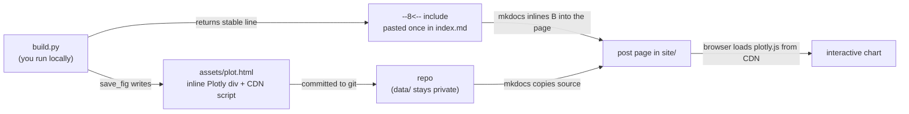

# Design Spec: Repository Architecture & Agent Rules

- **Date:** 2026-07-14
- **Status:** Implemented on `feat/repo-architecture` (§16 records the
  post-implementation amendments folded back into this spec)
- **Repo:** `avtsoof.github.io` (MkDocs personal portfolio + research blog)

## 1. Purpose

Establish a repository architecture for a personal MkDocs blog with a clear
two-tier philosophy:

- **Set up once (the CS part):** a tiny shared Python toolkit (`avtsoof/`) and an
  editable install. Done a single time, then left alone.
- **Per post (the fun part):** *copy a folder, write your experiment, call one
  helper to save a plot.* No class API, no CLI, no hand-maintained index — the
  author focuses on the concept and the experimentation, not plumbing.

It separates:

1. **Rendered content** (`docs/` → MkDocs → GitHub Pages),
2. **Global shared datasets** (`data/`, git-ignored), and
3. **A small shared toolkit** (`avtsoof/`, set up once).

...plus a lean AI-agent rule system (`AGENTS.md` + a few thin `.agents/skills/`).

## 2. Goals & Non-Goals

**Goals**
- A **one-time** shared toolkit (`avtsoof/` + `pip install -e .`) so per-post
  code is trivial: `from avtsoof.common_utils import data_dir, save_fig`.
- Adding a post = copy a template folder + edit front matter; the only code you
  write is the experiment itself.
- The blog index/archive/tags build themselves (Material blog plugin) — no
  hand-maintained registry.
- Optional interactive plots via one short `build.py` per post that calls the
  toolkit's `save_fig` helper.
- Root-level, git-ignored datastore reusable across posts, reached via
  `data_dir(name)` (no `cwd`/relative-path guessing).
- Lean `AGENTS.md`; detail delegated to a small number of thin skills.
- Git LFS for committed binaries; raw datasets stay git-ignored.
- Spec-driven work isolated on a branch, merged to `main` with `--no-ff`.

**Non-Goals**
- The toolkit stays **tiny** (paths + one figure-save helper); it is not a
  framework.
- No blog scaffolding CLI or hand-maintained index — a copyable template folder
  plus the Material blog plugin cover both.
- No per-project packaging; no CI changes beyond the MkDocs build.
- No content migration of real posts (only the one meta example post).

## 3. Target Directory Architecture

```text
avtsoof.github.io/
├── AGENTS.md                       # Lean, high-level repo rules + governance
├── README.md                       # project overview + setup (entry point)
├── README/
│   └── BLOGGING.md                 # how-to-blog guideline doc (§6.3)
├── .gitattributes                  # Git LFS tracking patterns
├── .gitignore                      # data/ ignored; stale Quarto lines removed
├── .githooks/                      # versioned hooks; wired via core.hooksPath (once)
│   ├── pre-push                    # git-required entrypoint; execs pre-push-main
│   └── pre-push-main               # on push to main: `mkdocs build --strict` IFF docs-affecting files changed
├── .agents/
│   └── skills/
│       ├── git-workflow/SKILL.md       # from Programming_Guidelines
│       ├── gitignore/SKILL.md          # from Programming_Guidelines
│       ├── clean-code/SKILL.md         # from Programming_Guidelines
│       ├── python-style/SKILL.md       # from Programming_Guidelines
│       ├── skill-authoring/SKILL.md    # skill minimalism + when to split
│       └── git-lfs/
│           ├── SKILL.md                # pre-commit LFS check
│           └── scripts/check_lfs.py    # single-skill helper (co-located)
├── avtsoof/                        # Shared toolkit — set up ONCE (importable)
│   ├── __init__.py
│   └── common_utils.py             # REPO_ROOT + data_dir() + save_fig()
├── pyproject.toml                  # minimal; makes `avtsoof` importable (pip install -e .)
├── data/                           # Root datastore — GIT-IGNORED
│   ├── .gitkeep
│   └── README.md
├── docs/                           # MkDocs source (public site)
│   ├── index.md                    # portfolio landing
│   ├── about.md
│   ├── blog/
│   │   ├── index.md                # Material blog plugin landing (auto-index)
│   │   ├── .authors.yml            # optional: author metadata
│   │   └── posts/
│   │       ├── _template/          # COPY ME to start a post (excluded from site)
│   │       │   ├── index.md        # front matter + prose skeleton
│   │       │   └── build.py        # optional: writes assets/*.html
│   │       └── <slug>/
│   │           ├── index.md        # article (front matter: date, tags…)
│   │           ├── build.py        # optional: computes plots (excluded from site)
│   │           └── assets/         # generated interactive HTML / images
│   └── superpowers/                # specs/plans — EXCLUDED from site build
│       └── specs/
├── mkdocs.yml                      # Material theme + blog plugin; excludes *.py, superpowers/
└── requirements.txt                # unified deps (references -e . for the toolkit)
```

## 4. Core Architectural Rules

`AGENTS.md` is a **lean index**, not a rulebook. It contains ONLY:

- the directory-architecture diagram (§3) — a **skeleton** of the structure only
  (top-level dirs + representative placeholders like `<slug>/`), NOT an
  enumeration of growing content. Updated only when the folder **structure**
  changes, never as content grows.
- a few one-line repo invariants (R1–R3 below), and
- a pointer table mapping task types → the skill that owns the detail.

When in doubt, a rule belongs in a skill (§6), not in `AGENTS.md`.

- **R1 — Posts are self-contained folders:** each post lives in
  `docs/blog/posts/<slug>/` (lowercase, hyphenated) with its `index.md`, optional
  `build.py`, and `assets/`. *(Detail: `README/BLOGGING.md`.)*
- **R2 — Root datastore:** all raw/binary datasets live under root `data/`,
  which is fully git-ignored; never committed under `docs/`.
  *(Detail: `README/BLOGGING.md`.)*
- **R3 — Delegation:** `AGENTS.md` points to the thin skills under
  `.agents/skills/`; agents load the relevant skill for the task at hand.

## 5. Two Tiers: One-Time Toolkit + Minimal Per Post

### 5.1 One-time setup (the "set & forget" CS part)
- `avtsoof/common_utils.py` — a **tiny** shared module, written once:
  ```python
  REPO_ROOT: Path                              # located via a pyproject.toml marker
  DOCS = REPO_ROOT / "docs"

  def data_dir(name: str) -> Path: ...         # REPO_ROOT/data/<name> (git-ignored)

  def save_fig(fig, out: Path) -> str:         # inline-<div> embed
      # out.parent.mkdir(parents=True, exist_ok=True)
      # fig.write_html(out, include_plotlyjs="cdn", full_html=False,
      #                div_id=out.stem)        # deterministic id → reproducible file
      # returns a STABLE, path-derived snippet-include line (never changes per run):
      #   f'--8<-- "{out.relative_to(DOCS)}"'
      ...
  ```
  The inline `<div>` fragment auto-sizes and inherits the site theme, so there is
  **no** `height` argument and **no** `<iframe>`. The deterministic `div_id`
  means an unchanged experiment re-generates a byte-identical file (no git churn).
- A minimal root `pyproject.toml` makes `avtsoof` importable via
  `pip install -e .`, run **once** as part of `bootstrap.py`. No
  per-script `sys.path` hacks, no `cwd` assumptions.
- The same setup step wires the **versioned git hooks** once via
  `git config core.hooksPath .githooks` (see §11.1), so the pre-push build gate
  (active only on pushes to `main`) is available in every clone without copying
  anything into `.git/hooks/`.
- This tier is touched only when a helper is genuinely reused (§5.3), not per post.

### 5.2 Per post (the minimal, content-focused part)
- **Create:** copy `docs/blog/posts/_template/` → `docs/blog/posts/<slug>/`,
  rename, and fill in the front matter (`date`, `title`, `tags`, `categories`).
  That is the entire "new post" flow — no CLI, no code generation.
- **Index:** the **Material blog plugin** discovers the post from its `date`
  front matter and auto-builds the blog landing page, archive, categories, tags,
  and (optionally) RSS. There is no registry file to keep in sync.
- **Plots (optional):** if a post needs a computed interactive figure, its
  `build.py` stays short and focuses on the experiment — the plumbing lives in
  the toolkit:
  ```python
  # docs/blog/posts/<slug>/build.py  —  run:  python build.py
  from pathlib import Path
  import plotly.express as px
  from avtsoof.common_utils import data_dir, save_fig

  HERE = Path(__file__).parent

  def main() -> None:
      df = ...                              # load from data_dir("<name>")
      fig = px.line(df, x=..., y=...)       # <-- the actual experiment
      save_fig(fig, HERE / "assets" / "plot.html")

  if __name__ == "__main__":
      main()
  ```
  `build.py` files are excluded from the built site (§9).
- **Embed (write once, never touch again):** `save_fig` returns a **stable
  snippet-include line** — e.g. `--8<-- "blog/posts/<slug>/assets/plot.html"` —
  that you paste into `index.md` a single time. It is derived from the output
  path, so it is identical on every run: re-running `build.py` overwrites
  `plot.html` in place and the build re-inlines the fresh content, but the line
  in `index.md` never changes. It is an include *reference*, not the pasted chart
  HTML — so there is nothing to re-paste.

**How a plot reaches the page:**



### 5.3 Growing the toolkit
- If two posts genuinely need the same helper, move it into `avtsoof/` — that is
  exactly what the shared toolkit is for. Add helpers *only when* real
  duplication appears, keeping `avtsoof/` tiny.

## 6. Skill System

### 6.1 Governance (thin skills, linked from `AGENTS.md`)
- **Skill minimalism** → `skill-authoring` skill: every skill stays as thin /
  low-token as possible; split only when a skill genuinely grows too large.
- **Spec-driven work** → `git-workflow` skill: changes implemented from a
  spec/design file are done on a dedicated branch (atomic commits), then
  integrated to `main` with `git merge --no-ff`.

### 6.2 Guidelines → skills (retire the monolith)
`guidelines/Programming_Guidelines.md` is split into and replaced by:
- `git-workflow` skill — Git methodology, atomic commits, build integrity,
  commit messages, workflow hygiene, the branch + `--no-ff` merge rule, **plus
  the `.githooks/pre-push-main` strict-build gate (§11.1)**.
- `gitignore` skill — gitignore methodology, scope, security, syntax.
- `clean-code` skill — language-agnostic clean-code / SRP / robustness rules.
- `python-style` skill — Python-specific style (pathlib, argparse, typing).

### 6.3 The blogging guideline doc
- `README/BLOGGING.md` — the single how-to-blog reference, kept thin. It is a
  **guideline doc for both the author and the agent, not a skill** (it is
  repo-specific authoring guidance rather than a general agent capability);
  `AGENTS.md` points to it. Covers:
  - **New post:** copy `_template/` → `<slug>/`; fill front matter. Before
    creating, glance at the existing `docs/blog/posts/*/index.md` titles to avoid
    repeating a topic (a quick look, not a tool).
  - **Plots:** the `build.py` pattern (§5.2) using the toolkit's `save_fig`
    helper (inline `<div>`), and pasting its returned stable snippet-include line
    into `index.md` once.
  - **Data:** raw/large datasets live under git-ignored root `data/`, reached via
    `avtsoof.common_utils.data_dir(name)`; never commit raw data under `docs/`.
  - **Toolkit:** import shared helpers from `avtsoof.common_utils`; promote a
    helper into `avtsoof/` only when a second post needs it (§5.3).
  - **Site boundaries:** MkDocs builds only `docs/`; `*.py` and `superpowers/`
    are excluded (§9).

### 6.4 Git hygiene skill
- `git-lfs` skill — thin; mandated by `AGENTS.md` as a pre-commit check.
  Delegates to `.agents/skills/git-lfs/scripts/check_lfs.py` to infer whether any
  staged file is large/binary and not yet LFS-tracked, and if so add a
  `.gitattributes` pattern + `git lfs track` before committing.

## 7. Blog Index (auto-generated)

- The **Material blog plugin** generates the blog landing page, archive,
  category, and tag pages directly from each post's front matter. There is **no**
  hand-maintained registry and nothing to keep in sync.
- `docs/blog/index.md` is just the plugin's landing stub; posts appear
  automatically once their folder exists with a valid `date`.

## 8. Files: What's Committed, Ignored & LFS

**Lifecycle (answers "what is duplicated / discarded?"):**
- **Raw datasets** → `data/`, **git-ignored**. The heavy originals never enter
  git and are unavailable in CI.
- **Generated plots** (`docs/blog/posts/<slug>/assets/*.html`) → **committed**.
  They are the lightweight, shareable rendering of the experiment. Because the
  raw data is git-ignored (so `build.py` cannot run in CI), the plots must be
  built locally and committed for the site build to find them. With
  `include_plotlyjs="cdn"` + deterministic `div_id`, an unchanged experiment
  reproduces a byte-identical file — no noisy diffs, no duplication.
- **Build output** (`site/`) → **git-ignored**, regenerated on every build and by
  CI; never committed. This is the only "copied/intermediate" tier, and it is
  discarded-and-rebuilt, so the committed plot is never duplicated in git.

**LFS:**
- `.gitattributes` tracks committed **binaries** via LFS:
  `*.png *.jpg *.jpeg *.gif *.webp *.pdf *.parquet *.npy *.npz *.h5 *.zip *.mp4`.
- Generated `*.html` plots are **text** (data as JSON; plotly.js via CDN, not
  inlined) → normal git, **not** LFS. Put a plot in LFS only if it ever embeds a
  genuinely huge dataset.
- Raw datasets under `data/` are git-ignored and therefore never need LFS.
- The `git-lfs` skill + `check_lfs.py` catch new binary types before commit.

## 9. MkDocs Configuration

- Switch `theme: readthedocs` → Material (`theme: { name: material }`),
  resolving the `requirements.txt` (`mkdocs-material`) vs config mismatch.
- Enable the built-in **blog plugin**:
  ```yaml
  plugins:
    - blog:
        blog_dir: blog
  ```
- Exclude specs/plans and post build-scripts/templates from the built site:
  ```yaml
  exclude_docs: |
    superpowers/
    *.py
    blog/posts/_template/
  ```
- Enable the snippet-include extension used by `save_fig`'s returned line:
  ```yaml
  markdown_extensions:
    - pymdownx.snippets:
        base_path: [docs]     # `--8<--` paths are resolved relative to docs/
        check_paths: true     # fail the build if a referenced plot is missing
  ```
- `nav` points to `docs/` sources; the blog is reached via the plugin's
  generated landing page (`blog/index.md`).
- Because `docs_dir` defaults to `docs/`, root `data/`, `avtsoof/`, and
  `pyproject.toml` are automatically excluded from the build — a documented
  guarantee, not extra config.
- CI (`.github/workflows/publish.yml`) runs `mkdocs build --strict`, the same
  build-integrity gate as the local and pre-push builds.

## 10. Cleanups (existing repo)

- Remove duplicate root `index.md` / `about.md` (keep the `docs/` versions);
  update `nav` accordingly.
- Delete empty placeholder dirs `examples/` and `learn/`.
- `.gitignore`: drop stale Quarto lines (`/_site/`, `/.quarto/`); add `data/` and
  `site/` (the MkDocs build output).
- Retire `guidelines/Programming_Guidelines.md` after its content is migrated to
  skills (§6.2).

## 11. Branch & Merge Workflow

- Implementation is performed on a dedicated branch, e.g.
  `feat/repo-architecture`.
- Each phase below is an **atomic commit** on that branch; every commit builds on
  the previous and must leave the repo in a buildable state.
- **What `mkdocs build --strict` is for:** it renders the whole site into `site/`
  and **promotes MkDocs warnings to hard errors** (non-zero exit), so a commit
  fails fast instead of silently shipping a broken site. In this repo it
  specifically catches:
  - a broken internal link or a `nav:` entry pointing at a missing page;
  - a missing `pymdownx.snippets` include — e.g. an `--8<--` line whose
    `plot.html` was never generated/committed (`check_paths: true`, §9);
  - a page that exists on disk but is absent from `nav` (and vice-versa).
  It is the per-commit **build-integrity gate**: the same command CI runs before
  deploying to GitHub Pages, so "passes locally" means "will publish cleanly".
  Run it on any commit that touches `docs/`, `mkdocs.yml`, or generated assets.
- Integrate to `main` with `git merge --no-ff`.

### 11.1 Automated pre-push build gate

Rather than relying on memory to run the strict build, a **versioned `pre-push`
hook** runs it automatically — but only when it is actually needed.

- **Location & activation:** Git requires the hook filename to be exactly
  `pre-push`, so `.githooks/pre-push` is a **one-line dispatcher** that execs the
  descriptively-named `.githooks/pre-push-main` (where the real logic lives; both
  committed and reviewable). The hooks are activated once per clone by `git
  config core.hooksPath .githooks`, wired into `bootstrap.py` (§5.1).
  Nothing is copied into the un-versioned `.git/hooks/`.
- **Conditional trigger:** the hook only acts when the push **updates `main`**
  (`remote_ref = refs/heads/main`) — pushes to feature branches (e.g.
  `feat/repo-architecture`) are never gated. For a matching ref it then inspects
  the commits being pushed (`<remote_sha>..<local_sha>` from stdin, falling back
  to the merge-base with `main` for a brand-new `main`) and runs the build **only
  if** a changed path matches a docs-affecting pattern:
  `^(docs/|mkdocs\.yml$|avtsoof/.*\.py$|requirements\.txt$)`. A push to `main`
  that touches only, say, a skill or this spec skips the build and returns
  instantly.
- **Action:** when triggered it runs `mkdocs build --strict`; a non-zero exit
  **aborts the push** so a broken site never reaches `origin` / GitHub Pages.
- **Escape hatch:** `git push --no-verify` bypasses it for the rare intentional
  case (and remote CI still runs the same strict build as the backstop).
- **Portability:** the hook is a POSIX `sh` script; on Windows it runs under the
  Git-for-Windows bundled shell, so one file covers users on every platform.

Sketch:

```sh
# .githooks/pre-push  — git-required entrypoint (delegates to the named script)
#!/bin/sh
exec "$(dirname "$0")/pre-push-main" "$@"
```

```sh
# .githooks/pre-push-main
#!/bin/sh
# Run `mkdocs build --strict` before pushing to main, but only if
# docs-affecting files changed in the range being pushed.
relevant='^(docs/|mkdocs\.yml$|avtsoof/.*\.py$|requirements\.txt$)'
zero='0000000000000000000000000000000000000000'
run=0

while read -r local_ref local_sha remote_ref remote_sha; do
    [ "$remote_ref" = "refs/heads/main" ] || continue  # only gate pushes to main
    [ "$local_sha" = "$zero" ] && continue             # branch deletion
    if [ "$remote_sha" = "$zero" ]; then                # main doesn't exist yet on remote
        base=$(git merge-base main "$local_sha" 2>/dev/null)
        range=${base:+$base..}$local_sha
    else
        range="$remote_sha..$local_sha"
    fi
    if git diff --name-only "$range" | grep -Eq "$relevant"; then
        run=1
    fi
done

[ "$run" -eq 0 ] && exit 0
echo "pre-push: docs-affecting changes on main → mkdocs build --strict"
mkdocs build --strict || {
    echo "pre-push: strict build failed — push aborted (use --no-verify to override)" >&2
    exit 1
}
```

*(Detail/ownership: the `git-workflow` skill; §6.2.)*

## 12. Implementation Phases (atomic commits)

0. **Branch:** create `feat/repo-architecture` off `main`. (or check if already exists)
1. **AGENTS.md + README + guidelines split:** write lean `AGENTS.md` (directory
   diagram + invariants R1–R3 + a pointer table — no detailed rules) and a root
   `README.md` entry point (overview, setup, where-things-live pointers); split
   `guidelines/` into `git-workflow`, `gitignore`, `clean-code`, `python-style`
   skills; add `skill-authoring` skill; retire
   `guidelines/Programming_Guidelines.md`.
2. **Shared toolkit (one-time):** `avtsoof/` (`__init__.py`,
   `common_utils.py` with `REPO_ROOT`, `data_dir()`, `save_fig()`) + minimal
   `pyproject.toml`; wire `pip install -e .` into `bootstrap.py` and
   reference it from `requirements.txt`.
3. **Blogging doc + LFS skill:** the `README/BLOGGING.md` guideline doc
   (copy-template flow, `build.py` + `save_fig` pattern, data access, site
   boundaries) and the `git-lfs` skill +
   `.agents/skills/git-lfs/scripts/check_lfs.py`.
4. **Git hygiene files:** `.gitignore` fixes + `.gitattributes` (LFS patterns) +
   `.githooks/pre-push` dispatcher + `.githooks/pre-push-main` (conditional
   strict-build gate, §11.1) with `core.hooksPath` wired into `bootstrap.py`.
5. **MkDocs:** Material theme + blog plugin + `exclude_docs` + `nav` + cleanups
   (remove dup root `index.md`/`about.md`, delete `examples/` + `learn/`).
6. **Scaffolding:** git-ignored `data/` (`.gitkeep` + README); blog landing stub
   `docs/blog/index.md`; the `docs/blog/posts/_template/` folder (`index.md`
   skeleton + optional `build.py` using `save_fig`).
7. **Worked meta post:** copy the template to
   `docs/blog/posts/designing-a-personal-website-repo/`; fill the article + one
   interactive Plotly plot via its `build.py`.
8. **Integrate:** merge `feat/repo-architecture` into `main` with `--no-ff`.

## 13. Testing / Validation

- `pip install -e .` then
  `python -c "from avtsoof.common_utils import REPO_ROOT, data_dir, save_fig"`
  works from any `cwd`.
- Copying `_template/` → `docs/blog/posts/<slug>/` and filling front matter makes
  the post appear on the auto-generated blog index.
- `python build.py` inside a post folder writes `assets/*.html` via `save_fig`.
- `git check-ignore data/x` confirms `data/` is ignored.
- `mkdocs build --strict` succeeds; `site/` contains no `superpowers/`, no `*.py`,
  and no `_template/` path.
- After setup, `git config core.hooksPath` returns `.githooks`; a push to `main`
  that changes a `docs/` file triggers the strict build, a docs-untouched push to
  `main` skips it, and a push to a feature branch is never gated. A push to
  `main` with a deliberately broken link is rejected by the hook.
- The meta post renders with a working embedded interactive plot.

## 14. Risks & Mitigations

- **Code leaking into the site:** a `build.py` or template could ship to
  `site/` → `exclude_docs` drops `*.py` and `blog/posts/_template/`; validated by
  the `mkdocs build --strict` check (§13).
- **LFS gaps:** a new binary type slips in untracked → `check_lfs.py` pre-commit
  check flags unknown binary/large files.
- **Import fragility:** avoided by the one-time editable install + `REPO_ROOT`
  anchor, so `avtsoof.common_utils` and `data_dir()` work from any `cwd` — no
  `../../` guessing in per-post scripts.
- **Toolkit creep:** the shared toolkit could bloat into a framework → keep it to
  paths + `save_fig`; promote helpers only on real, second-use duplication (§5.3).
- **Include-path drift:** the `--8<--` line is resolved against `base_path:
  [docs]`; `save_fig` returns a `docs`-relative path and `check_paths: true`
  fails the build if a plot is missing, so a broken embed can never ship silently.
- **Forgetting the strict build before push:** the `.githooks/pre-push` gate
  (§11.1) runs it automatically on docs-affecting pushes to `main`; remote CI
  repeats the same strict build as a backstop for `--no-verify` overrides or
  unconfigured clones.

## 15. Author's Manual Validation Walkthrough

Once the structure is implemented, verify it end-to-end yourself:

1. **Fresh setup:** in a clean clone, run `python bootstrap.py`. Confirm
   it creates the venv and runs `pip install -e .` without error.
2. **Toolkit import:** from a *different* folder (e.g. your home dir) run
   `python -c "from avtsoof.common_utils import REPO_ROOT, data_dir, save_fig; print(REPO_ROOT)"`
   — it should print the repo root, proving `cwd`-independence.
3. **Create a throwaway post:** copy `docs/blog/posts/_template/` →
   `docs/blog/posts/hello-test/`; set a `date` in the front matter.
4. **Run the plot:** put a few points in `data/hello-test/`, then
   `cd docs/blog/posts/hello-test && python build.py`. Confirm `assets/plot.html`
   appears and `build.py` printed the include line.
5. **Paste once:** put that include line in `hello-test/index.md`.
6. **Live preview:** `mkdocs serve` and open the local URL. Check that:
   - the post appears automatically on the blog index (no registry edit), and
   - the interactive chart renders inline (hover/zoom work) and matches the theme.
7. **Re-run is a no-op for prose:** run `python build.py` again unchanged and
   confirm `git status` shows **no** change to `index.md` (only possibly
   `plot.html`, and only if the data changed).
8. **Strict build:** `mkdocs build --strict` passes, and `site/` contains no
   `superpowers/`, no `*.py`, and no `_template/` path.
9. **Ignore checks:** `git check-ignore data site` prints both paths.
10. **Clean up:** delete `docs/blog/posts/hello-test/` and `data/hello-test/`.

